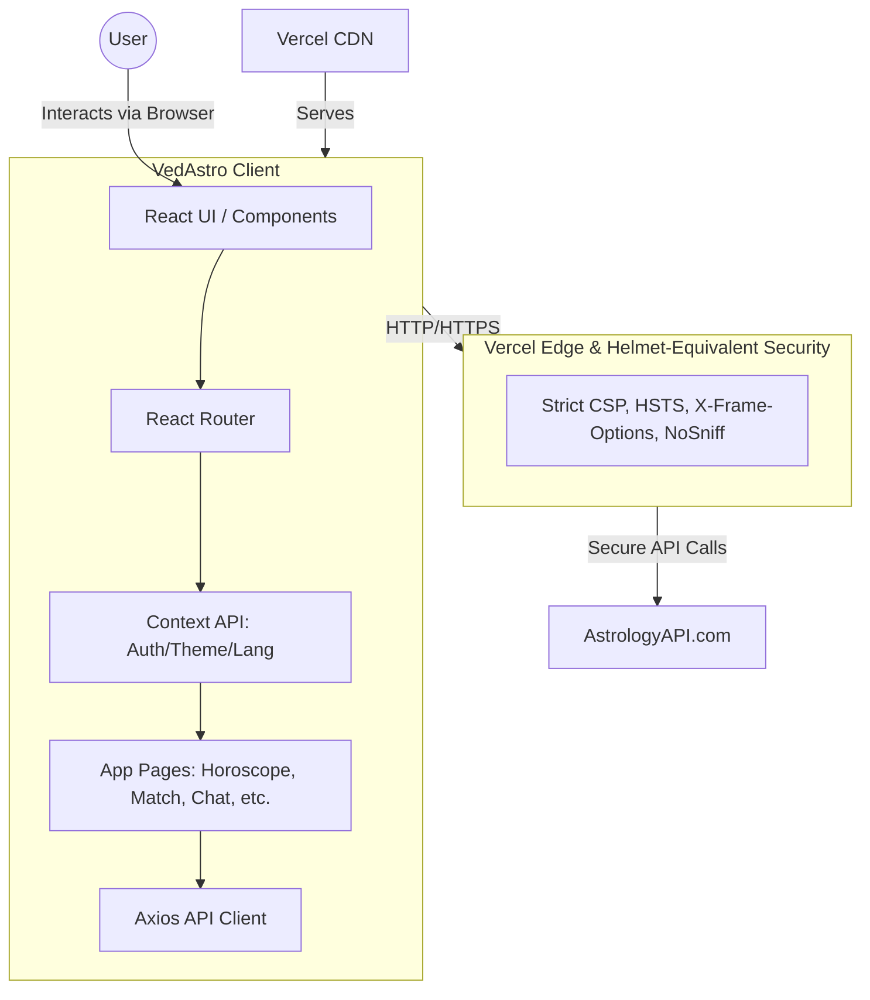

# 🪐 VedAstro - Ancient Wisdom. Digital Precision.

## 📝 Summary
VedAstro is a modern, responsive, and secure web application that brings ancient Vedic Astrology into the digital era. Powered by AstrologyAPI.com, the platform offers users a comprehensive suite of astrological tools, including birth charts, horoscope analysis, daily panchang, numerology, Kundli matching, and a unique AI astrologer chat interface. 

## 🛠️ Technical Stack
* **Frontend:** React 19, Vite
* **Styling:** Tailwind CSS, Framer Motion (for smooth animations)
* **3D/Graphics:** Three.js, React Three Fiber (for immersive backgrounds)
* **Routing:** React Router DOM
* **State/Context:** React Context API (Auth, Theme, Language)
* **API Integration:** Axios (AstrologyAPI.com)
* **Deployment & Security:** Vercel (Edge-level security headers)

## 📋 Prerequisites
Before you begin, ensure you have met the following requirements:
* **Node.js** (v18.0.0 or higher recommended)
* **npm**, **yarn**, or **pnpm** package manager
* An active **API Key** (Access Token) from [AstrologyAPI.com](https://astrologyapi.com)

## 🏗️ System Architecture



## 🚀 Use Process
1. **Clone the repository:**
   ```bash
   git clone <your-repo-url>
   cd vedastroapp
   ```
2. **Install dependencies:**
   ```bash
   npm install
   ```
3. **Run the development server:**
   ```bash
   npm run dev
   ```
4. **Usage within the App:**
   * Open your browser to `http://localhost:5173`.
   * Click **Get Started** on the welcome page.
   * Enter your `AstrologyAPI` Access Token on the Setup page (stored securely in local storage, never on a third-party server).
   * Explore the various tools like Birth Charts, Horoscope, Panchang, and the AI Chat feature!

## 🌐 Online Deploy Link
> **Deployment Status:** Pending  
> **Link:** `[Link to be added here upon Vercel deployment]`

## 🔒 Security Concerns & Protections
VedAstro is built with a security-first approach to protect user credentials and ensure that the application is resistant to common web exploitation vulnerabilities. We implemented multi-layered defense mechanisms, making it exceptionally difficult for attackers to compromise the application.

* **Client-Side Storage:** User API Keys are stored strictly within the browser's `localStorage`. They are never sent to a proprietary backend, minimizing the risk of data breaches.
* **Network-Level Security (Vercel Edge):** We configured `vercel.json` to enforce strict security headers, acting as a cloud-level Helmet protection:
  * **Content-Security-Policy (CSP):** Highly restrictive CSP to prevent Cross-Site Scripting (XSS). Only whitelisted domains and scripts are allowed to execute.
  * **Strict-Transport-Security (HSTS):** Enforces HTTPS connections across the board.
  * **X-Frame-Options:** Set to `DENY` to completely eliminate Clickjacking vulnerabilities.
  * **Permissions-Policy:** Restricts unauthorized access to device hardware (camera, microphone, geolocation) by default.
  * **Referrer-Policy:** Prevents sensitive URL information from leaking when navigating away from the app.
* **Document-Level Fallback:** The `index.html` file includes Helmet-equivalent meta tags as a secondary layer of defense. If the app is run locally or moved off Vercel, the browser will still enforce strict CSP and Referrer policies natively.
