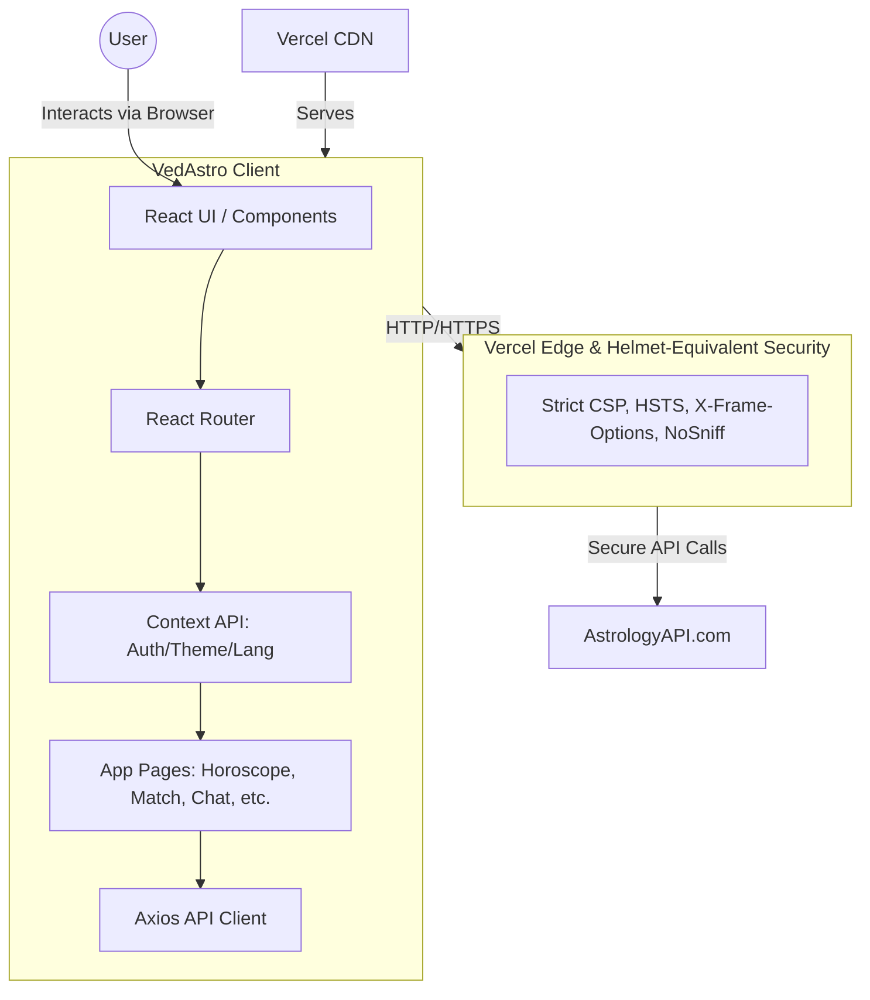

# 🪐 VedAstro - Ancient Wisdom. Digital Precision.


## 📝 Summary
VedAstro is a modern, responsive, and secure web application that brings ancient Vedic Astrology into the digital era. Powered by AstrologyAPI.com, the platform offers users a comprehensive suite of astrological tools, including birth charts, horoscope analysis, daily panchang, numerology, Kundli matching, and a unique Astrological Insights Chat guide.

## 📸 Screenshots


1. **The 3D Background & Dashboard** - Glassmorphism UI over an interactive starfield.
2. **Birth Chart View** - Detailed planetary position tables and North/South Indian charts.
3. **Astrological Insights Chat** - Interactive chat interface for parsing astrological data.

## 🛠️ Technical Stack
* **Frontend:** React 19, Vite
* **Styling:** Tailwind CSS, Framer Motion (for smooth animations)
* **3D/Graphics:** Three.js, React Three Fiber (for immersive backgrounds)
* **Routing:** React Router DOM
* **State/Context:** React Context API (Auth, Theme, Language)
* **API Integration:** Axios (AstrologyAPI.com)
* **Deployment & Security:** Vercel (Edge-level security headers)

## 📋 Prerequisites
Before you begin, ensure you have met the following requirements:
* **Node.js** (v18.0.0 or higher recommended)
* **npm**, **yarn**, or **pnpm** package manager
* An active **API Key** (Access Token) from [AstrologyAPI.com](https://astrologyapi.com)

## 🏗️ System Architecture



## 🚀 Use Process
1. **Clone the repository:**
   ```bash
   git clone <your-repo-url>
   cd vedastroapp
   ```
2. **Install dependencies:**
   ```bash
   npm install
   ```
3. **Run the development server:**
   ```bash
   npm run dev
   ```
4. **Usage within the App:**
   * Open your browser to `http://localhost:5173`.
   * Click **Get Started** on the welcome page.
   * Enter your `AstrologyAPI` Access Token on the Setup page. (This is stored strictly in memory and will be cleared when you close the tab).
   * Explore the various tools like Birth Charts, Horoscope, Panchang, and the Insights Chat feature!

## 🌐 Online Deploy Link
> **Deployment Status:** Pending  
> **Link:** `[Link to be added here upon Vercel deployment]`

## 🔒 Security & Reliability
VedAstro is built with a security-first approach to protect user credentials and ensure that the application is resistant to common web exploitation vulnerabilities.

* **In-Memory Credentials:** The API Key is **never** saved to `localStorage` or any persistent client-side storage. It is held securely in React Context memory. If the page is refreshed or closed, the key is wiped, preventing cross-site scripting (XSS) or extensions from scraping persistent tokens.
* **Strict Input Sanitization:** All birth chart and matching inputs are strictly validated and parsed (checking boundaries for latitude, longitude, dates, and times) before any API requests are formulated. This prevents malicious injection and malformed requests.
* **Network-Level Security (Vercel Edge):** We configured `vercel.json` to enforce strict security headers, acting as a cloud-level Helmet protection:
  * **Content-Security-Policy (CSP):** A highly precise CSP explicitly whitelists only `json.astrologyapi.com`, `fonts.googleapis.com`, and `fonts.gstatic.com`. All unauthorized connections are blocked.
  * **Strict-Transport-Security (HSTS):** Enforces HTTPS connections across the board.
  * **X-Frame-Options:** Set to `DENY` to completely eliminate Clickjacking vulnerabilities.
* **Document-Level Fallback:** The `index.html` file includes Helmet-equivalent meta tags as a secondary layer of defense natively in the browser.
* **Comprehensive Error Handling:** API failures, rate limits, and network aborts are elegantly caught and presented via UI banners and toasts, preventing silent failures and raw error leakage.

## 🌍 Internationalization (i18n)
VedAstro features a custom, lightweight multi-language implementation via React Context (`LanguageContext.jsx`), dynamically adapting content for English, Hindi, and Bengali users without the bloat of external i18n libraries.

## 📄 License
This project is licensed under the MIT License - see the [LICENSE](LICENSE) file for details.
