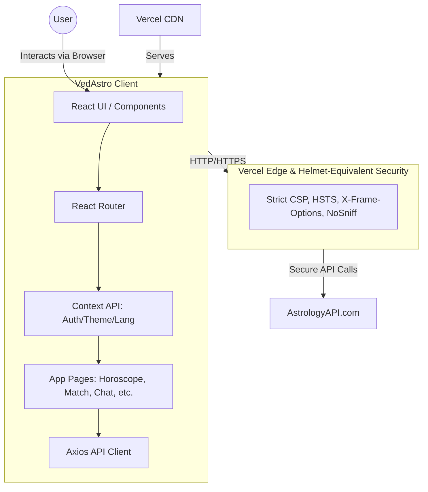

# 🪐 VedAstro - Ancient Wisdom. Digital Precision.

## 📝 Summary
VedAstro is a modern, responsive, and highly secure web application that brings ancient Vedic Astrology into the digital era. Powered by AstrologyAPI.com for precise astrological calculations and OpenRouter (Claude/Gemini) for a true AI Astrologer experience, the platform offers a comprehensive suite of tools including birth charts, horoscope analysis, daily panchang, numerology, Kundli matching, and a streaming AI guide.

## 📸 Screenshots


## 🛠️ Technical Stack
* **Frontend:** React 19, Vite 5
* **Styling:** Tailwind CSS, Framer Motion (for smooth animations)
* **3D/Graphics:** Three.js, React Three Fiber (for immersive backgrounds)
* **AI & LLM:** OpenRouter API (Claude 3.5 Sonnet, Gemini Flash) with real-time streaming
* **Geolocation:** OpenStreetMap (Nominatim), TimeAPI for automatic GPS & Timezone detection
* **Routing:** React Router DOM
* **State/Context:** React Context API (Auth, Theme, Language)
* **Deployment & Security:** Vercel (Edge-level security headers, API rewrites)

## 📁 Folder Structure

```text
vedastroapp/
├── public/                 # Static assets (Favicon)
├── src/
│   ├── api/                # API communication layers
│   │   ├── astrologyApi.js # Vedic Astrology data endpoints
│   │   └── vedaGuruAI.js   # OpenRouter LLM streaming integration for VedaGuru
│   ├── components/
│   │   ├── cards/          # Reusable data display (PlanetCard, SignCard, DashaTimeline)
│   │   ├── chat/           # Chat UI, Typing Indicators, and XSS-sanitized ChatBubbles
│   │   ├── layout/         # App shell (Navbar, Sidebar, BottomNav)
│   │   └── ui/             # Smart components (CitySearch with GPS, GlassCards, etc.)
│   ├── context/            # Global State (AuthContext, LanguageContext)
│   ├── pages/              # Main screens (Home, BirthChart, Horoscope, Match, Chat)
│   ├── router/             # React Router configuration (AppRouter)
│   ├── utils/              # Core logic (dashaCalculator, docxGenerator, storage)
│   ├── App.jsx             # Root application component
│   └── main.jsx            # React DOM mounting point
├── package.json            # Strict dependencies list
├── vercel.json             # Vercel deployment, edge security headers, and proxies
└── vite.config.js          # Vite build config & local development proxies
```
## 🏗️ System Architecture



## ✨ New Features & Improved Components

* **True AI Astrologer (`vedaGuruAI.js`):** Migrated from basic static keyword templates to a live, streaming LLM agent powered by OpenRouter. It dynamically parses the user's birth chart and planetary alignments to provide highly analytical, direct, and straightforward life predictions.
* **Smart City & GPS Search (`CitySearch.jsx`):** A unified location component that automatically fetches Latitude, Longitude, Area Pincodes, and calculates accurate Timezone offsets using `Nominatim` and `TimeAPI`. Features a one-click "Use GPS" button.
* **Rich Chat UI (`ChatBubble.jsx`):** Parses and formats LLM Markdown natively (bolding, paragraphs) for a clean reading experience, while strictly sanitizing outputs to prevent Cross-Site Scripting (XSS).
* **API Edge Proxying:** External APIs (like OpenRouter) are securely proxied through Vercel's Edge Network (`/openrouter-api`), avoiding CORS limitations and hiding direct external communication.

## 📋 Prerequisites
* **Node.js** (v18.0.0 or higher recommended)
* An active **AstrologyAPI.com** User ID & API Key.
* An active **OpenRouter** API Key for the VedaGuru AI Chat.

## 🚀 Use Process
1. **Clone the repository:**
   ```bash
   git clone <your-repo-url>
   cd vedastroapp
   ```
2. **Install dependencies:**
   ```bash
   npm install --legacy-peer-deps
   ```
3. **Run the development server:**
   ```bash
   npm run dev
   ```
4. **Usage:**
   * Open your browser to `http://localhost:5173`.
   * On the Setup page, enter your `AstrologyAPI` Key and `OpenRouter` Key.
   * Enter your Birth details using the smart City Search autocomplete.
   * Explore your Horoscope and chat with the AI VedaGuru!

## 🔒 Security & Reliability (Helmet Equivalent)

VedAstro is built with a defense-in-depth, security-first approach to protect user credentials and ensure resilience against modern web exploitation.

* **In-Memory Credentials:** API Keys are strictly stored in React Context memory or `localStorage`. We do not have a centralized backend database that can be breached to steal user API keys.
* **Vercel Edge Security Headers (Helmet Equivalent):** We configured `vercel.json` to enforce strict security headers, acting as a cloud-level Helmet protection directly at Vercel's edge network:
  * **Content-Security-Policy (CSP):** Highly precise CSP explicitly whitelists only our required endpoints (`astrologyapi.com`, `openrouter.ai`, `nominatim.openstreetmap.org`, `timeapi.io`). Unauthorized connections are blocked.
  * **Strict-Transport-Security (HSTS):** Enforces HTTPS connections globally.
  * **X-Frame-Options (`DENY`):** Completely eliminates Clickjacking vulnerabilities.
  * **Permissions-Policy:** Strict restrictions on device sensors while explicitly allowing `geolocation=(self)` for our GPS button.
* **Bulletproof XSS Protection:** To safely render the AI's markdown formatting, we use `dangerouslySetInnerHTML` in `ChatBubble.jsx`. However, **all HTML brackets (`<`, `>`) and entities are explicitly escaped and sanitized** before Markdown is processed. This guarantees that neither an LLM hallucination nor a user injection can execute `<script>` tags or malicious DOM events.
* **Edge Proxying:** OpenRouter calls are proxied via Vercel Rewrites (`/openrouter-api`), maintaining a clean origin policy and preventing API exposure errors.
* **Client-Side Quota Protection:** Because API Keys are provided by the individual user, the application is immune to global quota exhaustion attacks. An attacker can only deplete their own personal quota.

## 🌍 Internationalization (i18n)
VedAstro features a custom, lightweight multi-language implementation (`LanguageContext.jsx`), dynamically adapting content and LLM system prompts for English, Hindi, and Bengali users.

## 📄 License
This project is licensed under the MIT License - see the [LICENSE](LICENSE) file for details.
